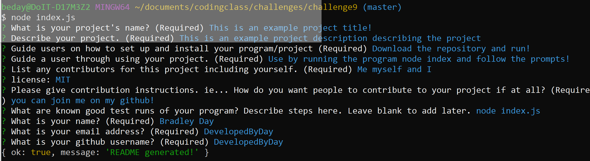

# Professional README Generator

## Description 
The code contained within this repository allows for the generation of professional Readme markdown file for any project. Via a series of prompts in the terminal using node.js you can use this package to create your own professional readme! These will generate in the "dist" folder. 

There is an example generated ReadMe in the "dist" folder of the repository.

The assets folder contains screenshot and video walkthrough.

## Video Walkthrough

  - shows node functions working and generating readme.

 - shows the table of contents working. 

## Screenshot

## Table of Contents (Optional)

* [Installation](#installation)
* [Usage](#usage)
* [Credits](#credits)
* [License](#license)

## Installation

Download this repository and ensure that you have node.js installed on your machine.

## Usage 

Navigate to the folder you downloaded the repo into using your terminal and then type "node index." Follow the prompts from here to generate your read me. Check the "dist" folder in the main subdirectory to find your generated markdown file. 

## Credits

UW-Madison Extension Coding Bootcamp assisted in this project. 

## License

MIT

## Badges

## Contributing

If you would like to imporve this application please find it at  

## Tests

In terminal try the following! (Each new line represents clicking "enter")

node index 

enter your information in each section

